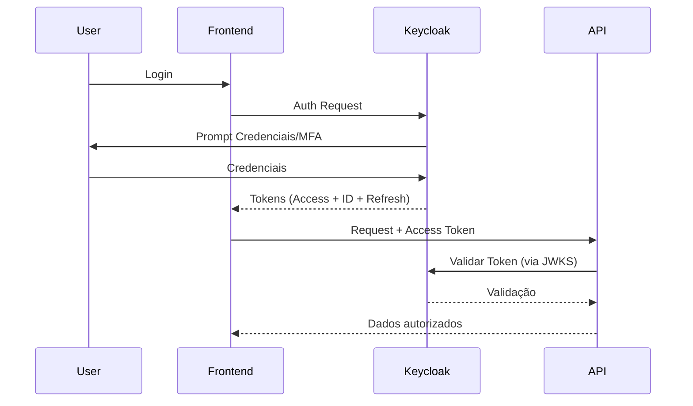

# 📘 Documentação Técnica — Keycloak

## 1. Visão Geral

**Keycloak** é um *Identity and Access Management* (IAM) de código-aberto que fornece serviços de **autenticação, autorização e gerenciamento de identidade** para aplicações e APIs.
Baseado em **OAuth 2.0**, **OpenID Connect (OIDC)** e **SAML 2.0**.

---

## 2. Principais Funcionalidades

### 🟢 2.1 Autenticação

| Funcionalidade        | O que Faz                                       | Para que Serve                      |
| --------------------- | ----------------------------------------------- | ----------------------------------- |
| Login/Logout          | Gerencia o fluxo de entrada e saída do usuário  | Autenticação centralizada para apps |
| Login Social          | Permite login com Google, Facebook, GitHub, etc | Facilitar acesso sem cadastro       |
| Login com LDAP/AD     | Integra com LDAP/Active Directory               | Uso de diretórios corporativos      |
| MFA/2FA               | Verificação dupla via TOTP, SMS, e-mail         | Aumentar segurança                  |
| Login com certificado | Autenticação via certificado x.509              | Ambientes corporativos mais seguros |
| Login via SAML        | Autenticação federada SAML                      | Integrar com provedores SAML        |

---

### 🟢 2.2 Autorização

| Funcionalidade         | O que Faz                         | Para que Serve                        |
| ---------------------- | --------------------------------- | ------------------------------------- |
| Roles (Funções)        | Define papéis (admin, user, etc)  | Controle de acesso baseado em funções |
| Groups (Grupos)        | Agrupa usuários com permissões    | Organização e herança de permissões   |
| Scopes                 | Limita permissões em tokens OAuth | Autorização por escopo                |
| Policies & Permissions | Regras detalhadas de acesso       | Autorização avançada por regras       |
| Resource Server        | Define recursos (dados/URI)       | Controle fino por recurso             |

---

### 🟢 2.3 OAuth2 / OpenID Connect

| Item               | O que Faz                               | Uso                               |
| ------------------ | --------------------------------------- | --------------------------------- |
| Authorization Code | Gera token após autenticação            | Apps web seguras                  |
| Implicit Flow      | Token direto no front (não recomendado) | Apps SPA antigos                  |
| PKCE               | Protege fluxo de código em mobile/SPAs  | Segurança extra em OAuth          |
| Refresh Token      | Atualiza token expirado                 | Sessões longas sem login          |
| JWT                | Token assinado com claims               | Comunicação segura entre serviços |

---

### 🟢 2.4 Single Sign-On (SSO)

| Funcionalidade     | Descrição                               |
| ------------------ | --------------------------------------- |
| Sessão Única       | Login uma vez e usar em vários sistemas |
| Logout Global      | Termina todas aplicações de uma vez     |
| Session Management | Ver sessões ativas por usuário          |

---

### 🟢 2.5 Identity Brokering

| O que é                       | Para que Serve                        |
| ----------------------------- | ------------------------------------- |
| Conectar identidades externas | Permite login via provedores externos |
| Gerenciar provedores          | Ex.: Google, Azure AD, Facebook       |

---

### 🟢 2.6 User Management

| Funcionalidade            | Descrição                           |
| ------------------------- | ----------------------------------- |
| CRUD de Usuários          | Criar, editar, remover              |
| Credenciais               | Senha, OTP, certificados            |
| Atributos customizados    | Dados extras por usuário            |
| Import/Export de usuários | Migração e backup                   |
| Gerenciamento de Grupos   | Organização por times/departamentos |

---

### 🟢 2.7 Tokens & Chaves

| Tipo          | Descrição                                      |
| ------------- | ---------------------------------------------- |
| Access Token  | Token de acesso à API                          |
| ID Token      | Informações do usuário                         |
| Refresh Token | Renova o token principal                       |
| JWKS          | Publica as chaves públicas para validar tokens |

---

### 🟢 2.8 Admin Console & Account Console

| Console      | Função                                                |
| ------------ | ----------------------------------------------------- |
| Admin        | Configuração de realms, clientes, usuários, roles     |
| User/Account | Usuário final visualiza sessão, tokens, configurações |

---

### 🟢 2.9 Multitenancy — Realms

| O que é                                     | Para que Serve                          |
| ------------------------------------------- | --------------------------------------- |
| Realms                                      | Ambientes independentes de autenticação |
| Cada realm tem seus usuários/roles/clientes | Multitenancy por aplicação/cliente      |

---

### 🟢 2.10 Provedores de Extensão

| Tipo de extensão                 | Funcionalidade                      |
| -------------------------------- | ----------------------------------- |
| SPI (Service Provider Interface) | Customização via plugins            |
| Events Listener                  | Receber eventos de login/logout     |
| Protocol Mappers                 | Mapear claims customizados          |
| Authenticator                    | Fluxos customizados de autenticação |

---

### 🟢 2.11 Internationalization (i18n)

| O que Faz                   | Para que Serve                  |
| --------------------------- | ------------------------------- |
| Suporte a múltiplos idiomas | Interfaces de login traduzíveis |

---

## 3. Protocolos que o Keycloak Suporta

| Protocolo                 | Descrição                              |
| ------------------------- | -------------------------------------- |
| **OAuth 2.0**             | Padrão de autorização                  |
| **OpenID Connect (OIDC)** | Padrão de autenticação/redes sociais   |
| **SAML 2.0**              | Federated SSO (corporativo)            |
| **LDAP / Kerberos**       | Integração com diretórios corporativos |

---

## 4. Como o Keycloak Funciona — Visão de Alto Nível



---

## 5. Casos de Uso Comuns

✅ **SSO corporativo**
✅ **APIs seguras com OAuth2/JWT**
✅ **Login com rede social**
✅ **Aplicações mobile**
✅ **Integração com AD/LDAP**
✅ **Multi-tenant usando Realms**
❌ **Banco de dados de negócio ou gestão de dados da aplicação**

---

## 6. Limitações & Pontos de Atenção

### ⚠️ Armazenamento

* User storage nativo é ótimo, mas **não substitui um banco de dados de aplicação**
* Integração com LDAP/AD pode ter limitações de sincronização

### ⚠️ Complexidade

* Curva de aprendizado alta para configurações avançadas
* Integração com sistemas legados pode exigir customização

### ⚠️ UI/UX

* Admin Console não tem interface modernizada
* Customização de temas exige templates

### ⚠️ Escalabilidade

* Recomendado usar **clustering e DB dedicado**
* Instância única pode se tornar gargalo

### ⚠️ Personalização Avançada

* Para lógica complexa de autorização, precisa escrever **SPI/Providers em Java**
* Não há suporte oficial em Node.js para providers

### ⚠️ Performance

* JWT rotaciona chaves — Se muitos serviços dependem de verificação direta, pode impactar
* Uso pesado de sessions → pode exigir Redis/Cache

### ⚠️ Backup/Upgrades

* Requisitos de migração cuidadosos entre versões
* Scripts customizados podem quebrar com upgrades

---

## 7. Comparações Rápidas (quando avaliar alternativas)

| Recurso         | Keycloak | Auth0           | AWS Cognito |
| --------------- | -------- | --------------- | ----------- |
| Código aberto   | ✅        | ❌               | ❌           |
| SSO corporativo | ✅        | ✅               | Limitado    |
| Custo           | Gratuito | Pago            | Pago        |
| Multi-tenant    | Realms   | Organiz. tenant | User Pools  |
| Infra própria   | Sim      | Não             | Sim         |

---

## 8. Checklist de Integração

### Antes de começar

✔ Definir real(s)
✔ Modelar usuários/roles/grupos
✔ Definir protocolo (OIDC ou SAML)
✔ Configurar clientes
✔ Planejar token scopes e claims

### Produção

✔ Configurar HTTPS/SSL
✔ Redundância e clustering
✔ Banco de dados externo
✔ Logs e monitoramento
✔ Backup dos realms

---

## 9. Exemplos de Fluxos de Autenticação

### OIDC com Authorization Code + PKCE

1. Frontend inicia autorização
2. Keycloak mostra login
3. Emite Authorization Code
4. Frontend troca por Access/Refresh Tokens

---

## 10. Recursos Úteis (estrutura sugerida)

```
/realms/{realm}/protocol/openid-connect/auth
/realms/{realm}/protocol/openid-connect/token
/realms/{realm}/protocol/openid-connect/logout
/realms/{realm}/account
/auth/realms/{realm}/.well-known/openid-configuration
```

---

## 11. Conclusão

O Keycloak é uma plataforma poderosa de **IAM**, ideal para aplicações modernas distribuídas.

✔ Centraliza autenticação/ autorização
✔ Suporta padrões modernos
✔ É expansível via plugins
✔ Possui comunidade ativa

⚠️ Mas exige:

* Configuração cuidadosa
* Planejamento de arquitetura
* Alguma familiaridade com protocolos de segurança
